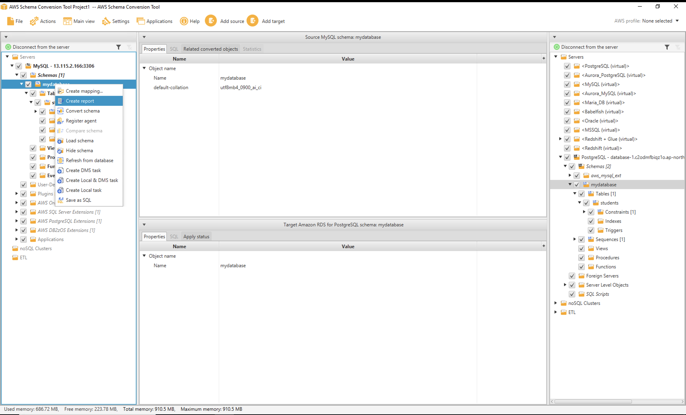
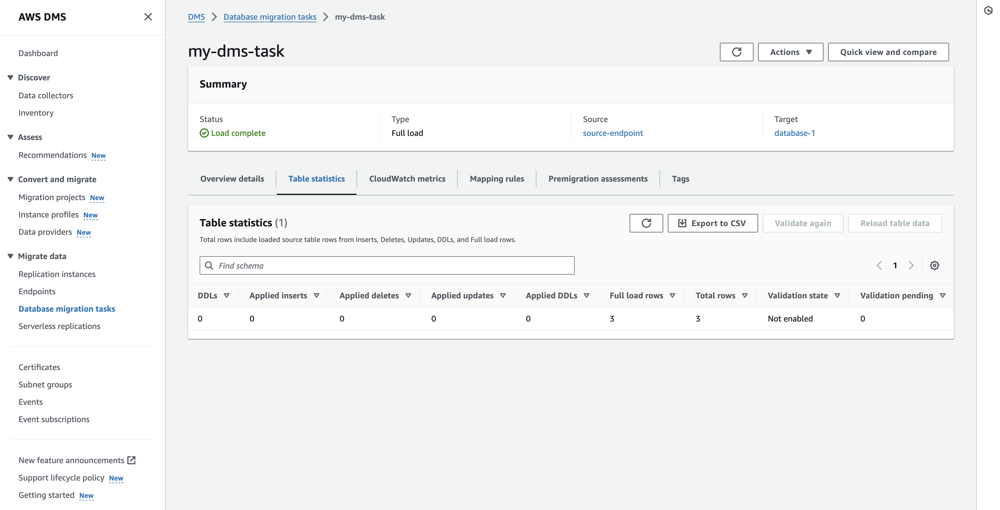

# Migrating Heterogeneous Databases to AWS RDS from On-Premises


**Step 1:** Launch an EC2 Instance and install the database software.


**Step 2:** Connect to the EC2 Instance or on-prem.


**Step 3:** Install MySQL or desired database software on the EC2 instance.

```
  sudo apt update -y
```


```
  sudo apt install mysql-server -y
```


```
  sudo mysql_secure_installation
```


**Step 4:** Connect to MYSQL.

```
  sudo mysql -u root -p
```


**Step 5:** Create replication user.

```
  create user 'your_user_name'@'%' IDENTIFIED BY 'your_password';
```


```
  GRANT REPLICATION SLAVE ON *.* TO 'your_user_name'@'%';
```


```
  GRANT ALL PRIVILEGES ON *.* TO 'your_user_name'@'%';
```


```
  FLUSH PRIVILEGES;
```


```
  exit;
```


**Step 6:** Change the bind address (IP address).

```
  nano /etc/mysql/mysql.conf.d/mysqld.cnf
```


**Step 7:** Restart MySQL server.

```
  sudo systemctl restart mysql
```


**Step 8:** Create database, tables, and insert data.

```
  mysql -u root -p 
```


```
  create database mydatabase;
```


```
  use mydatabase;
```


```
  CREATE TABLE students (
      id INT AUTO_INCREMENT PRIMARY KEY,
      first_name VARCHAR(50),
      last_name VARCHAR(50),
      age INT,
      grade VARCHAR(10)
  );  
```


```
INSERT INTO students (first_name, last_name, age, grade) VALUES
('John', 'Doe', 20, 'A'),
('Jane', 'Smith', 21, 'B'),
('Michael', 'Johnson', 19, 'A');
```


**Step 9:** Create database on Amazon RDS instance.


**Step 10:** Install AWS SCT (Schema Conversion Tool) and download drivers on your host machine.

**Note:** AWS SCT tools are supported on the following operating systems: 

-   Microsoft Windows 10
-   Fedora Linux 36 and higher
-   Ubuntu Linux 18 and higher

Additionally, you require drivers for both your source and target databases.
Example: 

- If your source database is MySQL, you need the MySQL driver.
- If your target database is PostgreSQL, you need the PostgreSQL driver.

To download the drivers and SCT tool, click [Here](https://docs.aws.amazon.com/SchemaConversionTool/latest/userguide/CHAP_Installing.html#CHAP_Installing.JDBCDrivers)

**In the image below, you can observe that we have downloaded the Schema Conversion Tool (SCT) along with the drivers for both the source and target databases.** 


**Step 11:** After downloading the drivers and installing the AWS SCT tool, you need to set the driver path

- Launch the AWS SCT Tool.


- Navigate to Settings and select Global Settings.


- Choose your driver path for both the source and target databases.


**Step 12:After configuring the driver path, the next step involves creating a project.** 

- Click on "File" and select "New Project".


- Provide the project name and click "OK"


**Step 13:Now, add the source and target databases.** 

- Click on "Add Source"


- Fill in the connection details, then click on "Accept the risk and continue" if you haven't configured SSL, and finally, test the connection.


**Note:** If the connection fails, please verify whether the Security Group, Network Settings, and Connection details are all correct.

- Click on "Add Target".


- Fill in the connection details and test the connection.


**Step 14:Create the Mapping from your source database to the target Database.** 

- Choose the desired database from the schemas dropdown menu.


- Right-click on the selected schema and choose "Create mapping".


- Select the source server under servers mapping and click on "New Migration Rule".


- Customize your rule according to your requirements.


*Once the rule is created, the following interface will appear.*


**Step 15:Once you have completed the mapping, return to the "DMS Migration View"**

**Note:** If the selected database name under schemas is not displayed in bold letters, it indicates that you have not yet created the database mapping, and consequently, you will be unable to convert your schema.


**Step 16:Before converting the schema, you need to check the assessment report.**

- Right-click on your database and select "Create report".



**Step 17:Right-click on your desired schema(database) and select “Convert Schema”.**


- After clicking on "Convert Schema", it will be displayed on the right side of your target database pane.

**After completing the above steps, the schema is converted and applied to the target database**

**Step 18:Now, navigate to the DMS (Database Migration Service) console and proceed to create a Replication Instance.**
- Provide the name of the DMS Replication Instance.
- Select the hardware specifications for your DMS Replication Instance.
- Choose the Engine Version.


- Select the availability.
- Allocate the storage.
- Choose your VPC and subnet group.
- Click on the checkbox.
- Select the availability zones.
- Select the Security Group.


**Step 19:Now, we need to create Endpoints.**

- We need to create two endpoints: one for the source and the other for the target.

**Source Endpoint**
- Click on "Create Endpoint"
- Provide a name for the Source Endpoint.
- Select the source Engine.
- Enter the IP address or endpoint of the source database.
- Specify the Port Number.
- Provide the database username and password.
- Test the connection. 
- Create the endpoint.


**Target Endpoint**

- Follow the same steps for the Target Endpoint.

**Note:**
*If you are using PostgreSQL, ensure that you select SSL Mode as "require". Otherwise, it may result in errors and connection failure during testing.*


**Step 20:Now, we need to create a Database Migration Task**
- Click on "Create task".
- Provide a name for the task.
- Select the replication instance.
- Choose the source and target endpoints.
- Choose the migration type.
- Create the selection rule:
   - Select the schema.
   - Provide the source (database) name.
   - Specify the table name that you want to migrate. If you use a wildcard (%) it will include all tables present in your schema.
   - Select the action. 
- Click on "Create task".


**Now, you can verify whether your content has been migrated successfully or not.**




**Now, let's connect to the RDS instance database and check for PostgreSQL**
- Connect to the database.

*psql -h  rds_database_endpoint  -U  rds_instance_username  -d  database_name*

```
  psql -h database-1.c2odmfbiqz1o.ap-northeast-1.rds.amazonaws.com -U postgres -d mydb
```
- To verify if the database exists or not.

```
  \dn
```

- Switch to the specific or migrated database.
*SET search_path TO database_name*
```
 SET search_path TO mydatabase;
```
- To verify the table name.

*SELECT table_name
FROM information_schema.tables
WHERE table_schema = 'database_name'
      AND table_type = 'BASE TABLE';*

```
 SELECT table_name
FROM information_schema.tables
WHERE table_schema = 'mydatabase'
      AND table_type = 'BASE TABLE';
```

- To retrieve the content of tables.
*SELECT * FROM database_name.table_name;*

```
 SELECT * FROM mydatabase.students;
```

